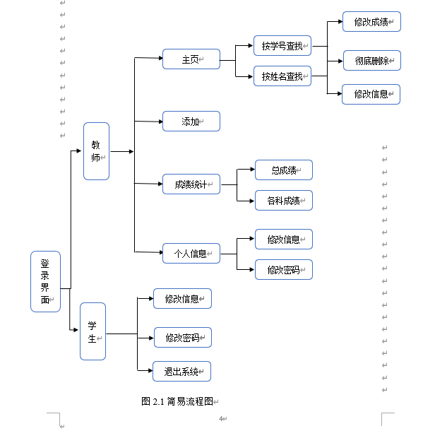
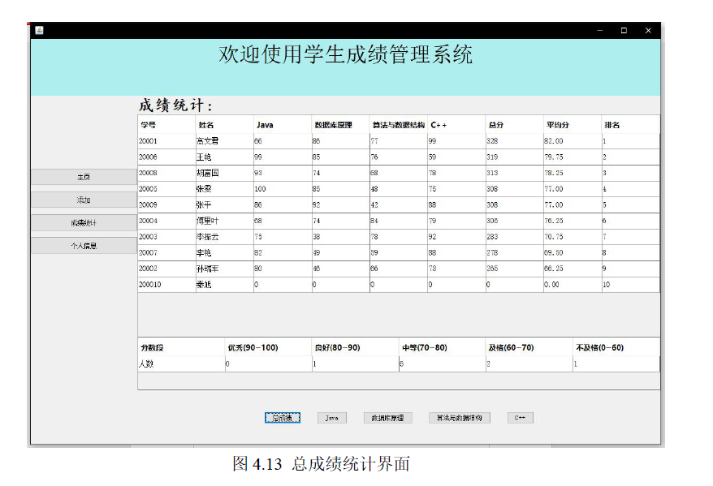

# Java-Swing-MySQL
Java课程设计-学生成绩管理系统

**系统需求分析**

- （1）实现数据的录入（添加）、删除、修改
- （2）按姓名或学号查询
- （3）按照成绩排序，按照成绩段统计汇总

**设计思路**

- （1）系统通过窗口显示并以菜单方式工作，；  
- （2）能查询、修改和删除文件中考生信息；
- （3）能够显示全部的考生信息；
- 根据上述系统功能分析，按照结构化程序设计的要求，得到系统的功能结构图，如图所示。
- 

运行结果：

